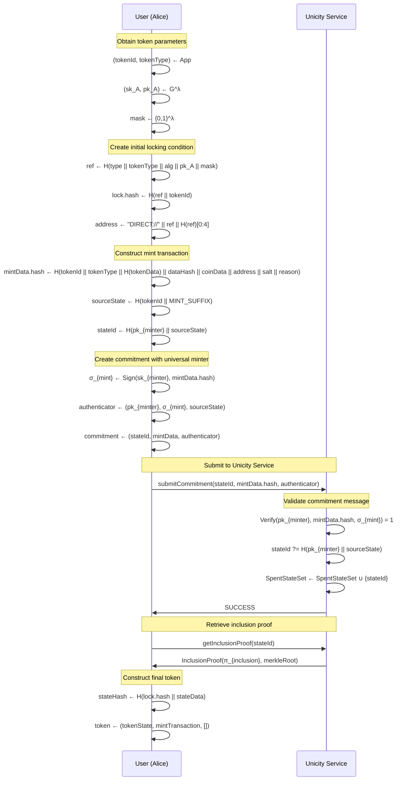
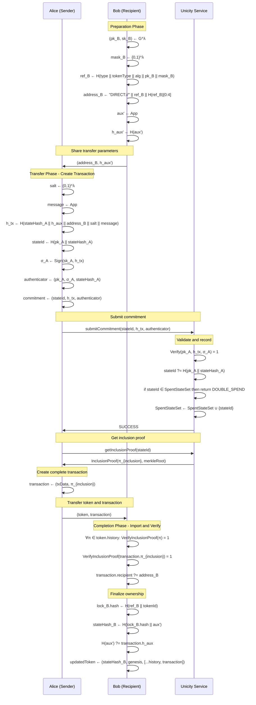
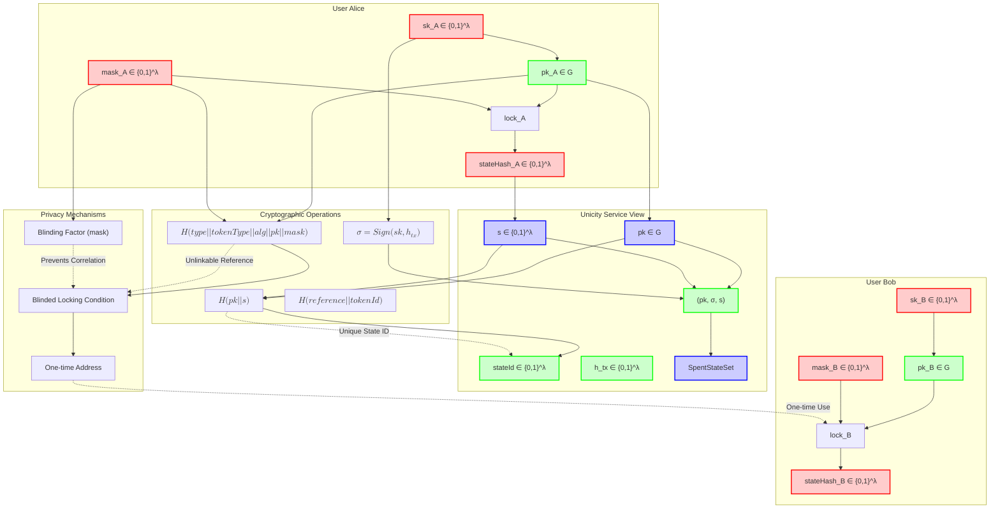

# Unicity Token SDK - Technical Documentation

## Abstract

The Unicity State Transition Protocol (Token SDK) implements a cryptographic token system with off-chain privacy and on-chain uniqueness guarantees. Tokens exist as self-contained cryptographic objects that can be transferred peer-to-peer while preventing double-spending through a uniqueness oracle service. The protocol achieves transaction unlinkability through masked predicates and provides verifiable state transitions without revealing transaction details to third parties.

## Changes in Terminology

There are following changes in terminology compared to the source code:

| Source Code    | Here            |
| -------------  | -------------   |
| Unicity Prover | Unicity Service |
| `RequestId`    | `StateId`       |
| Predicate      | Locking Condition |
| nonce          | blinding mask (where appropriate)|
| data           | aux (auxiliary data) |
| newData        | aux'            |


Proposed changes:

| Source Code    | Here            |
| -------------  | -------------   |
| argument to a Predicate | witness |
| Transition     | Transfer (pending state) |
| Transaction    | Transfer (final state)   |
| Commitment     | (Unicity Service) Request |
| Authenticator  | Spend Authorization, or just dissolve into its components? |
| Masked Predicate | Blinded Locking Condition |
| Unmasked Predicate | whatever so that it is clear that there is no unmasking as a step |
| Pointer        | one-time address? |
| Masked Predicate, Unasked Predicate | unify these, just use different mask generation algorithm (or a flag at higher level API) |


## 1. Core Cryptographic Primitives

### 1.1 Hash Functions and Digital Signatures

The protocol employs the following cryptographic primitives:

- **Hash Algorithm**: SHA-256 for all cryptographic operations
- **Digital Signature Scheme**: ECDSA with secp256k1 curve
- **Key Representation**: 33-byte compressed public keys
- **Signature Format**: 65-byte signatures in [R || S || V] format where V is the recovery ID

### 1.2 Data Encoding

All structured data is encoded using CBOR (Concise Binary Object Representation) before cryptographic operations to ensure deterministic serialization.

## 2. Protocol Architecture

### 2.1 Token Structure

A **Token** is a self-contained cryptographic object containing:

```
Token := {
  state: TokenState,           // Current ownership state
  genesis: MintTransaction,    // Initial creation proof
  transactions: Transaction[], // Complete transition history
  nametagTokens: NameTag[],   // Optional addressing tokens
  version: string             // Protocol version
}
```

**TokenState** represents a specific ownership configuration:

```
TokenState := {
  lock: LockingCondition,  // Ownership verification mechanism
  aux: bytes?,                // Optional state-specific auxiliary data
}
```

### 2.2 Locking Condition System

**Locking Conditions** define token ownership and spending conditions. Two primary types exist:

#### Locking Condition (Public Ownership)
```
LockingCondition := {
  type: "UNMASKED",
  publicKey: PublicKey,         // Owner's public key
  algorithm: string,            // Signature algorithm identifier
  hashAlgorithm: HashAlgorithm, // Hash algorithm identifier
  mask: bytes,                  // Deterministic blinding mask from salt signature
  reference: Hash(type || tokenType || algorithm || hashAlg || publicKey),
  hash: Hash(reference || tokenId || mask)
}
```

#### Blinded Locking Condition (Privacy-Preserving Ownership)
```
MaskedLockingCondition := {
  type: "MASKED",
  publicKey: PublicKey,         // Owner's public key
  algorithm: string,            // Signature algorithm identifier
  hashAlgorithm: HashAlgorithm, // Hash algorithm identifier
  mask: bytes,                  // Random blinding mask
  reference: Hash(type || tokenType || algorithm || hashAlg || publicKey || mask),
  hash: Hash(reference || tokenId)
}
```

Blinded locking conditions include a random blinding mask in the reference calculation, providing unlinkability between different token states owned by the same entity.

## 3. Unicity Service Interface

### 3.1 Abstract Interface

The protocol requires interaction with a **Unicity Service** (implemented as `IAggregatorClient`) providing the following abstract interface:

```typescript
interface UnicityService {
  // Submit a state transition commitment
  submitCommitment(
    stateId: StateId,        // Unique state identifier
    transactionHash: Hash,       // Transaction commitment
    authenticator: Authenticator  // Owner's authorization
  ): Promise<SubmitCommitmentResponse>

  // Retrieve inclusion proof for a committed transition
  getInclusionProof(
    stateId: StateId         // State identifier to query
  ): Promise<InclusionProof>
}
```

### 3.2 State Identifier Generation

**StateId** serves as a unique state identifier:

```
StateId := Hash(publicKey || stateHash)
```

Where:
- `publicKey` is the current owner's public key
- `stateHash` is the cryptographic hash of the token state

This construction ensures each token state has a globally unique identifier while maintaining privacy (the service sees only the hash, not the state details).

## 4. Authenticator Structure

### 4.1 Cryptographic Role

The **Authenticator** (kept opaque mostly) serves as the token owner's authorization to execute the request. It contains:

```
Authenticator := {
  publicKey: PublicKey,        // Owner's verification key
  signature: Signature,        // Digital signature over transaction
  stateHash: Hash             // Hash of the source state being spent
}
```

### 4.2 Verification Properties

The Authenticator provides cryptographic evidence that:
1. The signer possesses the private key corresponding to `publicKey`
2. The signer authorized the specific transaction (via `signature`)
3. The source state hash matches the claimed state (`stateHash`)
4. The state transition is legitimate without revealing state details

### 4.3 Unicity Service's Request Validation Algorithm

The Unicity Service validates an authenticator using the following algorithm:

```
Algorithm: ValidateAuthenticator(stateId, h_tx, authenticator)
Input:
  - stateId ∈ {0,1}^λ        // Claimed unique state identifier
  - h_tx ∈ {0,1}^λ            // Transaction commitment hash
  - authenticator = (pk, σ, s)   // Ownership proof to validate

Validation Steps:
1. Parse authenticator components:
   - pk ∈ G                      // Public key
   - σ ∈ {0,1}^*                // Digital signature
   - s ∈ {0,1}^λ              // State hash

2. Verify request ID construction:
   - r' ← H(pk || s)
   - if r' ≠ stateId then return INVALID

3. Verify digital signature:
   - if Verify(pk, h_tx, σ) ≠ 1 then return INVALID

4. Check uniqueness constraint:
   - if stateId ∈ SpentStateSet then return DOUBLE_SPEND
   - SpentStateSet ← SpentStateSet ∪ {stateId}

5. Return SUCCESS

Information Learned by Unicity Service:
  - stateId ∈ {0,1}^λ: Unique identifier (but not the actual token state)
  - pk ∈ G: Owner's public key (but not their identity)
  - s ∈ {0,1}^λ: Hash of source state (but not the state contents)
  - h_tx ∈ {0,1}^λ: Hash of transaction (but not transaction details)

Information Hidden from Unicity Service:
  - Token ID, type, or auxiliary data
  - Transaction recipient or transfer amount
  - Actual token state contents (only sees hash)
  - Relationship between different transactions by same owner
```

**Privacy Properties**: The Unicity Service learns only the minimum information necessary to prevent double-spending while remaining oblivious to token details, transaction specifics, and ownership relationships across different tokens.

## 5. Transaction Protocol Messages

### 5.1 State Transition Messages

#### Commitment Message
```
Commitment := {
  stateId: StateId,                 // Unique state identifier
  transactionData: TransactionData, // State transition details
  authenticator: Authenticator      // Ownership proof
}
```

#### Transaction Data
```
TransactionData := {
  hash: Hash,                    // Self-identifying hash
  sourceState: TokenState,       // Current state being spent
  recipient: Address,            // Destination address
  salt: bytes,                   // Random value for privacy
  dataHash: Hash?,               // Optional new state data commitment
  message: bytes?,               // Optional encrypted message
  nametagTokens: NameTag[]       // Optional addressing tokens
}
```

#### Mint Transaction Data
```
MintTransactionData := {
  hash: Hash,                    // Self-identifying hash
  tokenId: TokenId,              // Unique token identifier
  tokenType: TokenType,          // Token class identifier
  tokenData: bytes,              // Immutable token data
  coinData: CoinData?,           // Optional payload of fungible coins + values
  sourceState: stateId,          // Pseudo-source for minting
  recipient: Address,            // Initial owner address
  salt: bytes,                   // Randomness for ownership condition derivation
  dataHash: Hash?,               // Optional metadata commitment
  reason: Serializable?          // Optional mint justification
}
```

### 5.2 Transaction vs Transition Semantics

**Transaction**: Represents an incomplete state change where the sender knows the source state but not the complete destination state (only a reference/address).

**Transition**: Represents a completed state change where both source and destination states are fully specified. Created when the recipient resolves a transaction using their private information.

## 6. Addressing and Privacy Mechanisms

### 6.1 Address Types

#### Direct Address
```
DirectAddress := "DIRECT://" || Hex(predicate.reference.toCBOR()) || Hex(checksum[0:4])
```

Where `checksum = SHA-256(predicate.reference.toCBOR())[0:4]`

### 6.2 Privacy-Preserving Mechanisms

#### Masked Locking Condition System
- **Unlinkability**: Random blinding masks in masked locking conditions prevent correlation of token states owned by the same entity
- **Forward Privacy**: Previous owners cannot track subsequent token movements
- **Selective Disclosure**: Only the current owner can prove ability to unlock without revealing historical ownership

#### Salt-Based Privacy
- **Transaction Unlinkability**: Random salts in transactions prevent correlation
- **Address Unlinkability**: Different blinding masks create different addresses for the same public key

## 7. Anonymity Analysis

### 7.1 Anonymity Properties

#### Strong Anonymity Properties:
1. **Sender Anonymity**: The oracle cannot determine who initiated a transaction
2. **Recipient Anonymity**: The oracle cannot determine who received a token
3. **Transaction Unlinkability**: Different transactions by the same party are unlinkable
4. **Forward Privacy**: Past owners cannot track future token movements
5. **Amount Privacy**: Transaction values are hidden from the oracle

#### Anonymity Mechanisms:

**Blinding via Masked Locking Conditions**:
- The `mask` field in `MaskedPredicate` acts as a blinding factor
- `reference = Hash(type || tokenType || algorithm || hashAlg || publicKey || mask)`
- Different tokens controlled by the same key have unlinkable references

**Pointer-based Addressing**:
- Recipients generate fresh key material for each transaction
- Addresses cannot be correlated across different transfers
- One-time use addressing prevents traffic analysis

### 7.2 Anonymity Limitations

1. **Trusting the Service**: The Unicity Service could attempt traffic analysis, though it sees only commitments
2. **Network Analysis**: Communication channels between parties may be observable
3. **Timing Correlation**: Transaction timing patterns may reveal relationships
4. **Value Correlation**: If token amounts are revealed in other contexts, they may enable correlation

## 8. Security Properties

### 8.1 Cryptographic Guarantees

1. **Unforgeability**: Only the legitimate owner can create valid authenticators
2. **Double-Spend Prevention**: Each state can be transitioned at most once
3. **Non-Repudiation**: State transitions are cryptographically bound to their creators
4. **Integrity**: Token history cannot be modified without detection
5. **Unlinkability**: Token movements are unlinkable across state changes (with masked predicates)

### 8.2 Security Assumptions

1. **Discrete Logarithm Problem**: ECDSA security on secp256k1
2. **Hash Function Security**: SHA-256 preimage and collision resistance
3. **Honest-but-Curious Service**: Unicity Service correctly processes requests but may attempt traffic analysis
4. **Secure Channels**: Communication channels between parties provide confidentiality

## 9. Protocol Operation Flow

### 9.1 Token Creation (Minting) - Sequence Diagram



### 9.2 Token Creation (Minting) - Step-by-Step
1. Generate token parameters (ID, type, initial data)
2. Create initial locking condition and respective address
3. Construct `MintTransactionData` with token details
4. Create commitment using universal minter secret
5. Submit commitment to Unicity Service
6. Receive inclusion proof confirming unique creation
7. Construct initial token with genesis transaction

### 9.3 Token Transfer - Sequence Diagram



### 9.4 Token Transfer - Step-by-Step

1. **Preparation Phase**:
   - Recipient generates fresh locking condition and respective address
   - Recipient shares address and optional auxiliary data hash with sender

2. **Transfer Phase**:
   - Sender creates `TransactionData` with recipient address
   - Sender creates `Commitment` with proof of being able to unlock the locking condition
   - Sender submits commitment to Unicity Service
   - Service returns inclusion proof confirming uniqueness

3. **Completion Phase**:
   - Sender creates `Transaction` from commitment and inclusion proof
   - Sender transfers token and transaction to recipient
   - Recipient verifies complete token history and transaction
   - Recipient resolves transaction into transition using private information
   - Token state updated with new locking condition

### 9.5 Privacy and Cryptographic Relationships Diagram



**Legend:**
- 🔴 **Red (Private)**: Information known only to individual users
- 🟢 **Green (Public)**: Information that may be shared between parties
- 🔵 **Blue (Service)**: Information visible to the Unicity Service
- **Dashed arrows**: Cryptographic relationships and privacy properties

**Key Privacy Properties Illustrated:**
1. **Blinding**: Alice's blinding mask creates unlinkable locking conditions across different tokens
2. **One-time Addresses**: Bob generates fresh addresses for each transfer
3. **Minimal Unicity Service Knowledge**: Unicity Service sees only hashes and public keys, not token details
4. **Forward Privacy**: Once transferred, Alice cannot link Bob's future token movements

## 10. Implementation Considerations

### 10.1 Key Generation and Management
- Private keys must be securely generated and stored
- Blinding mask for blinded locking conditions should use cryptographically secure randomness
- Key derivation should follow established standards (e.g., BIP-44 for hierarchical keys)

### 10.2 Verification Requirements
- Complete token history must be verified before accepting transfers
- Inclusion proofs must be validated against known Unicity Service public keys
- Locking condition verification requires checking all cryptographic signatures

### 10.3 Privacy Best Practices
- Always use blinded Locking conditions for privacy-sensitive applications
- Generate fresh addresses for each transfer
- Avoid reusing key material across different tokens
- Implement secure deletion of sensitive intermediate values

## 11. Formal Protocol Notation

For formal analysis, the protocol state transitions can be expressed as:

```
State Transition Function:
τ: (Token × PrivateKey × Address × Data) → (Commitment × Transaction)

Token Update Function:
υ: (Token × Transaction × TokenState) → Token

Verification Function:
φ: (Token × PublicKey) → Boolean
```

Where valid state transitions satisfy:
- `φ(τ.token, privateKey.publicKey) = true` (ownership verification)
- Unicity Service accepts `τ.commitment` (uniqueness verification)
- `υ(token, τ.transaction, newState)` produces valid updated token

This formal structure enables rigorous security analysis and protocol verification.

---

*This documentation is mostly AI generated based on analysis of the TypeScript implementation in the state-transition-sdk; while ignoring the design documents.*