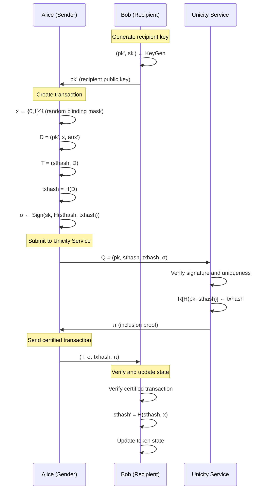

# Unicity Protocol TypeScript SDK - Data Structures Specification

## Core Cryptographic Primitives

### Hash Function and Digital Signatures

Basic type definitions:
```typescript
// Hash algorithm: SHA-256 ($H$ in the paper)
type Hash = ...
type PublicKey = ...
type PrivateKey = ...
type Signature = ...
// Random blinding mask for state transitions ($x$ in paper)
type BlindingMask = ...  // at least 128 bits of entropy
```

## Token State and Locking condition (Most common simple case: Ownership)

### Predicate structure
```typescript
/**
 * Predicate defines locking condition for a token as a parametrized boolean function. The locking happens by choosing the predicate type and set of locking parameters.
 * The proof of successful unlock happens by providing some unlocking arguments that render the predicate returning True value.
 * For the purpose of addressing and calculating Unicity request IDs, each predicate must provide a unique way to calculate its fingerprint/hash.
 * The predicate can be atomic or composite (consisting of other predicates joined via boolean operators). Composite predicates are out of scope of the current spec.
 *
 * Examples: burn (FALSE always), simple single pubkey lock, m/n multisig lock, timelock, atomic swap unlocker, generic WASM function, requirement to spend to specific addresses, recursive/composition of other predicates
 */
interface Predicate {
  /** Each specific predicate type would require a specific set of locking params and unlocking arguments.
   * TODO: In case of composite predicate, we need some param mapping scheme in order to map each locking param to one or more subpredicates
   */
  predicateType: PredicateType;
  lockingParams: Record<string, LockingParam>;

  /**
   * Based on the predicate type, locking params and the unlocking arguments, compute Boolean value
   * TODO: In the case of composite predicate, evaluate all the relevant subpredicates and the respective boolean expression concatinating the subpredicates
   */
  function evaluate(unlockingArguments: Record<string, UnlockingArg>): Boolean;

  /** Calculates the fingerprint/hash based on the predicate type and locking params.
   * TODO: In case of composite predicate, first calculate recursively the fingerprints of all its subpredicates, then hash the boolean expression composing all the subpredicates */
  function calculateFingerprint(): PredicateFingerprint;

  /**
   * TODO: define LockingParam and UnlockingArg types
   */
}

type PredicateFingerprint = Hash | PublicKey
```

### Token State Structure

```typescript
/**
 * TokenState represents the locking configuration of a token (particular common case: single pubkey ownership) by a predicate
 * In specific simple ownership case this corresponds to the state $(pk, aux)$ from the paper (we may consider pubkey ownership predicate as the default predicate type and always omot it for the simplicity). In the generic case this is $(predicateType, lockParams, aux)$
 */
interface TokenState {
  /** Current predicate fingerprint. In case of simple pubkey ownership, this can be owner's public key ($pk$ in paper) */
  predicateFingerprint: PredicateFingerprint;

  /** Optional auxiliary data for this state ($aux$ in paper) */
  auxiliaryData?: string; // hex-encoded bytes
}

/**
 * State identifier uniquely identifies a token state
 * Calculated as: stateId = H(predicateFingerprint || h_st)
 * In default pubkey ownership predicate, it corresponds to $H(pk, h_st)$ in the paper
 */
type StateId = Hash;
```

### State ID Calculation

```typescript
/**
 * Calculate unique state identifier from the predicate fingerprint and state hash
 * Formula: stateId = H(predicateFingerprint || h_st)
 * In default pubkey ownership predicate, it corresponds to $H(pk, h_st)$ in the paper
 */
function calculateStateId(publicKey: PublicKey, stateHash: Hash): StateId {
  return sha256(predicateFingerprint + stateHash);
}
```

## Transaction Data Structures

### Transaction Data

```typescript
/**
 * Transaction data structure for token transfers
 * Corresponds to $D = (pk', x, auxd)$ from the paper
 * Unified structure for both mint and transfer transactions
 */
interface TransactionData {
  /** Recipient's public key ($pk'$ in paper) */
  recipientPublicKey: PublicKey;

  /** Random blinding mask for privacy and state evolution ($x$ in paper) */
  blindingMask: BlindingMask;

  /** Auxiliary data for the transaction ($aux'$ in paper) */
  recipientAuxiliaryData: string; // hex-encoded bytes

  // Additional fields for mint transactions (zero/empty for transfers)

  /** Token identifier (only for mint transactions) */
  tokenId?: string;

  /** Token type identifier (only for mint transactions) */
  tokenType?: string;

  /** Mint justification/reason (only for mint transactions) */
  mintReason?: string;
}
```

### Transaction Structure

```typescript
/**
 * Complete transaction structure
 * Corresponds to $T = (h_st, D)$ from the paper
 */
interface Transaction {
  /** Current state hash before executing transaction ($h_st$ in paper) */
  currentStateHash: Hash;

  /** Transaction data containing recipient and other details */
  transactionData: TransactionData;
}

/**
 * Transaction data hash calculation
 * In the paper: $h_tx = \commitc(H(D))$
 * With unity commitment: $h_tx = H(D)$
 */
function calculateTransactionHash(d: TransactionData): Hash {
  return sha256(encodeTransactionData(d));
}
```

## Certified Transaction and Proofs

### Certified Transaction

```typescript
/**
 * Certified transaction with Unicity Service proofs
 * Corresponds to $(T, \sigma, h_tx, d, \pi)$ from the paper
 * With unity commitment, $d$ is omitted
 */
interface CertifiedTransaction {
  /** The transaction being certified */
  transaction: Transaction;

  /** Digital signature by current owner ($\sigma$ in paper) */
  signature: Signature;

  /** Transaction data hash ($h_tx$ in paper) */
  transactionHash: Hash;

  /** Inclusion proof from Unicity Service ($\pi$ in paper) */
  inclusionProof: InclusionProof;
}

/**
 * Inclusion proof from Unicity Service
 * Proves that a state transition was registered
 */
interface InclusionProof {
  /** Cryptographic proof data ($\pi_inc$ in paper) */
  proofData: string; // Implementation-specific proof format

  /** Merkle root or other verification anchor */
  merkleRoot?: Hash;

  /** Additional metadata for proof verification */
  metadata?: Record<string, any>;
}
```

## Unicity Service Interface

### Service Request Structure

```typescript
/**
 * Request to Unicity Service for state transition certification
 * Corresponds to $Q = (pk, h_st, h_tx, \sigma)$ from the paper
 */
interface UnicityServiceRequest {
  /** Current owner's public key ($pk$ in paper) */
  ownerPublicKey: PublicKey;

  /** Current state hash ($h_st$ in paper) */
  currentStateHash: Hash;

  /** Transaction data hash ($h_tx$ in paper) */
  transactionHash: Hash;

  /** Owner's signature authorizing the transition ($\sigma$ in paper) */
  signature: Signature;
}

/**
 * Response from Unicity Service
 */
interface UnicityServiceResponse {
  /** Whether the request was accepted */
  success: boolean;

  /** Inclusion proof if successful ($\pi_inc$ in paper) */
  inclusionProof?: InclusionProof;

  /** Error message if failed */
  error?: string;
}
```

### Abstract Unicity Service Interface

```typescript
/**
 * Abstract interface for Unicity Service interaction
 * Modeled as key-value store $R$ in the paper where:
 * - Keys are $H(pk, h_st)$ (StateId)
 * - Values are $h_tx$ (transaction hashes)
 */
interface UnicityService {
  /**
   * Submit a state transition request
   * Service checks:
   * 1. $R[H(pk, h_st)] = \bot$ (not already spent)
   * 2. $\sigver(pk, H(h_st, h_tx), \sigma) = 1$ (valid signature)
   * If both pass: $R[H(pk, h_st)] <- h_tx$
   */
  submitRequest(request: UnicityServiceRequest): Promise<UnicityServiceResponse>;

  /**
   * Verify inclusion proof
   * Corresponds to $\univer(k, v, \pi)$ from the paper
   */
  verifyInclusionProof(
    stateId: StateId,
    transactionHash: Hash,
    proof: InclusionProof
  ): Promise<boolean>;
}
```

## Token Structure and History

### Complete Token

```typescript
/**
 * Complete token with full transaction history
 */
interface Token {
  /** Current state of the token */
  currentState: TokenState;

  /** Genesis/mint transaction that created the token */
  genesis: CertifiedTransaction;

  /** Complete history of state transitions */
  transactionHistory: CertifiedTransaction[];

  /** Protocol version */
  version: string;

  /** Additional metadata (not part of cryptographic verification) */
  metadata?: Record<string, any>;
}
```

## Mint Transaction Specifics

### Mint Transaction Creation

```typescript
/**
 * Special handling for mint transactions
 * Uses fixed public minter key pair $(pk_mint, sk_mint)$
 */
interface MintTransactionConfig {
  /** Token identifier being minted */
  tokenId: string;

  /** Token type/class */
  tokenType: string;

  /** Immutable token data */
  tokenData: string;

  /** Initial owner's public key */
  initialOwnerPublicKey: PublicKey;

  /** Mint justification */
  reason?: string;
}

/**
 * Calculate mint state hash
 * Formula: $h_st = H(id, MINT\_SUFFIX)$
 */
function calculateMintStateHash(tokenId: string): Hash {
  const MINT_SUFFIX = "UNICITY_MINT_SUFFIX";
  return sha256(tokenId + MINT_SUFFIX);
}
```

## State Transition Algorithm

### Next State Calculation

```typescript
/**
 * Calculate next state hash after transaction
 * Formula: $h^i_st = H(h^{i-1}_st, x_{i-1})$
 * where $x_{i-1} = T_{i-1}.D.x$ (blinding mask from previous transaction)
 */
function calculateNextStateHash(currentStateHash: Hash, blindingMask: BlindingMask): Hash {
  return sha256(currentStateHash + blindingMask);
}

/**
 * Create next token state after successful transaction
 */
function transitionTokenState(
  currentState: TokenState,
  transaction: CertifiedTransaction
): TokenState {
  const nextStateHash = calculateNextStateHash(
    currentState.stateHash,
    transaction.transaction.data.blindingMask
  );

  return {
    ownerPublicKey: transaction.transaction.data.recipientPublicKey,
    stateHash: nextStateHash,
    auxiliaryData: transaction.transaction.data.auxiliaryData
  };
}
```

## Transaction Verification

### Verification Algorithm

```typescript
/**
 * Verify a certified transaction in a given state
 * Corresponds to $\certver(T, \sigma, h_tx, d, \pi; pk, h)$ from paper
 * Returns 1 if valid, 0 otherwise
 */
function verifyCertifiedTransaction(
  certifiedTx: CertifiedTransaction,
  expectedState: TokenState,
  unicityService: UnicityService
): Promise<boolean> {
  const { transaction, signature, transactionHash, inclusionProof } = certifiedTx;

  // Check 1: T.sthash = h (current state hash matches)
  if (transaction.currentStateHash !== expectedState.stateHash) {
    return false;
  }

  // Check 2: txhash = H(T.D) (transaction hash is correct)
  const calculatedHash = calculateTransactionHash(transaction.data);
  if (transactionHash !== calculatedHash) {
    return false;
  }

  // Check 3: sigver(pubkey, H(sthash, txhash), signature) = 1
  const signatureMessage = sha256(transaction.currentStateHash + transactionHash);
  if (!verifySignature(expectedState.ownerPublicKey, signatureMessage, signature)) {
    return false;
  }

  // Check 4: univer(H(pubkey, T.sthash), txhash, pi) = 1
  const stateId = calculateStateId(expectedState.ownerPublicKey, transaction.currentStateHash);
  return await unicityService.verifyInclusionProof(stateId, transactionHash, inclusionProof);
}
```

## Protocol Flow Diagrams

### Token Transfer Flow



