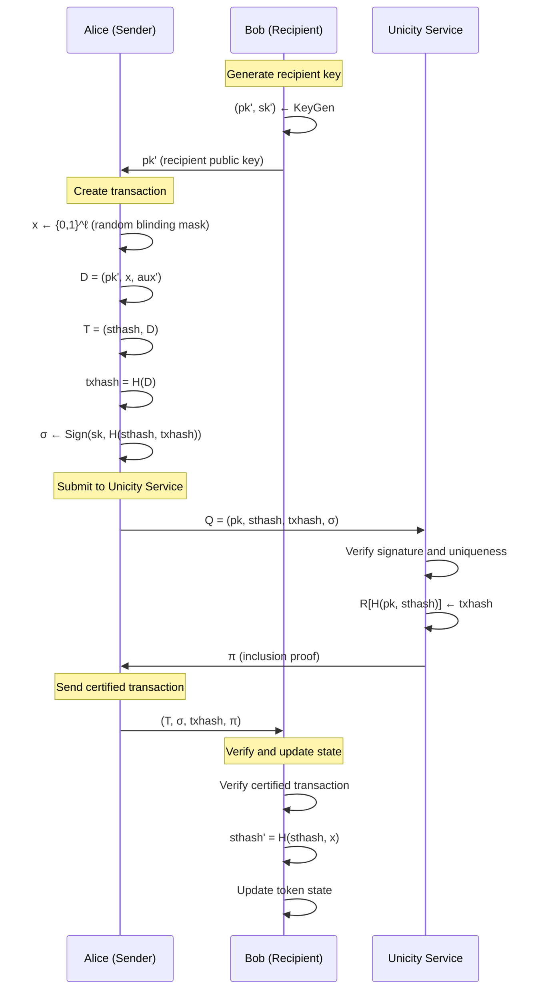

# Unicity Protocol TypeScript SDK - Data Structures Specification

## Core Cryptographic Primitives

### Hash Function and Digital Signatures

Basic type definitions:
```typescript
// Hash algorithm: SHA-256 ($H$ in the paper)
type Hash = ...
type PublicKey = ...
type PrivateKey = ...
type Signature = ...
// Random blinding mask for state transitions ($x$ in paper)
type BlindingMask = ...  // at least 128 bits of entropy
```

## Token State and Ownership

### Token State Structure

```typescript
/**
 * TokenState represents the ownership configuration of a token
 * Corresponds to the state $(pk, aux)$ from the paper
 */
interface TokenState {
  /** Current owner's public key ($pk$ in paper) */
  ownerPublicKey: PublicKey;

  /** Optional auxiliary data for this state ($aux$ in paper) */
  auxiliaryData?: string; // hex-encoded bytes
}

/**
 * State identifier uniquely identifies a token state
 * Calculated as: stateId = H(pk || h_st)
 * Corresponds to $H(pk, h_st)$ in the paper
 */
type StateId = Hash;
```

## Transaction Data Structures

### Transaction Data

```typescript
/**
 * Transaction data structure for token transfers
 * Corresponds to $D = (pk', x, aux')$ from the paper
 * Unified structure for both mint and transfer transactions
 */
interface TransactionData {
  /** Recipient's public key ($pk'$ in paper) */
  recipientPublicKey: PublicKey;

  /** Random blinding mask for privacy and state evolution ($x$ in paper) */
  blindingMask: BlindingMask;

  /** Auxiliary data for the next token state ($aux'$ in paper) */
  recipientAuxiliaryData: string; // hex-encoded bytes

  // Additional fields for mint transactions (zero/empty for transfers)
  mintTransactionData: MintTransactionData?;
}

MintTransactionData := {
  tokenId: TokenId,              // Unique token identifier
  tokenType: TokenType,          // Token class identifier
  tokenData: bytes,              // Immutable token data
  coinData: CoinData?,           // Optional payload of fungible coin + value
  reason: Serializable?          // Optional mint justification
  // bridged asset: burn or locking proof / reference
}

CoinData := {
  coinId: CoinId,
  balance: bigint;
}

// CoinId is a 32-byte identifier for a specific coin type
type CoinId = Uint8Array;  // 32 bytes

/**
 * Transaction data hash calculation
 * In the paper: $h_tx = \commitc(H(D))$
 * With unity commitment: $h_tx = H(D)$
 */
function calculateTransactionHash(d: TransactionData): Hash {
  return sha256(encodeTransactionData(d));
}
```

### Transaction Structure

```typescript
/**
 * Complete transaction structure
 * Corresponds to $T = (h_st, D)$ from the paper
 */
interface Transaction {
  /** Current state hash before executing transaction ($h_st$ in paper) */
  currentStateHash: Hash;

  /** Transaction data containing recipient and other details */
  transactionData: TransactionData;
}
```

## Certified Transaction and Proofs

### Certified Transaction

```typescript
/**
 * Certified transaction with Unicity Service proofs
 * Corresponds to $(T, \sigma, h_tx, d, \pi)$ from the paper
 * With unity commitment, $d$ is omitted
 */
interface CertifiedTransaction {
  /** The transaction being certified ($T$) */
  transaction: Transaction;

  /** Digital signature by current owner ($\sigma$ in paper) on transaction */
  signature: Signature;

  /** Transaction data hash ($h_tx$ in paper) */
  transactionHash: Hash;

  /** Inclusion proof from Unicity Service ($\pi$ in paper) */
  inclusionProof: InclusionProof;
}

/**
 * Inclusion proof from Unicity Service
 * Proves that a state transition was registered
 */
interface InclusionProof {
  /** Cryptographic proof data (opaque $\pi_inc$ in paper) */
  /** Documented elsewhere */
}
```

## Unicity Service Interface

### Service Request Structure

```typescript
/**
 * Request to Unicity Service for state transition certification
 * Corresponds to $Q = (pk, h_st, h_tx, \sigma)$ from the paper
 */
interface UnicityServiceRequest {
  /** Current owner's public key ($pk$ in paper) */
  ownerPublicKey: PublicKey;

  /** Current state hash ($h_st$ in paper) */
  currentStateHash: Hash;

  /** Transaction data hash ($h_tx$ in paper) */
  transactionHash: Hash;

  /** Owner's signature authorizing the transition ($\sigma$ in paper) */
  signature: Signature;
}

/**
 * Response from Unicity Service
 */
interface UnicityServiceResponse {
  /** Whether the request was accepted */
  success: boolean;

  /** Inclusion proof if successful ($\pi_inc$ in paper) */
  inclusionProof?: InclusionProof;

  /** Error message if failed */
  error?: string;
}
```

### Abstract Unicity Service Interface

```typescript
/**
 * Abstract interface for Unicity Service interaction
 * Modeled as key-value store $R$ in the paper where:
 * - Keys are $H(pk, h_st)$ (StateId)
 * - Values are $h_tx$ (transaction hashes)
 */
interface UnicityService {
  /**
   * Submit a state transition request
   * Service checks:
   * 1. $R[H(pk, h_st)] = \bot$ (not already spent)
   * 2. $\sigver(pk, H(h_st, h_tx), \sigma) = 1$ (valid signature)
   * If both pass: $R[H(pk, h_st)] <- h_tx$
   */
  submitRequest(request: UnicityServiceRequest): Promise<UnicityServiceResponse>;

  /**
   * Verify inclusion proof
   * Corresponds to $\univer(k, v, \pi)$ from the paper
   * A standalone function to verify self-contained proof in reality
   */
  verifyInclusionProof(
    stateId: StateId,
    transactionHash: Hash,
    proof: InclusionProof
  ): Promise<boolean>;
}
```

## Token Structure and History

### Complete Token

```typescript
/**
 * Complete token with full transaction history
 */
interface Token {
  /** Protocol version */
  version: string;

  /** Current state of the token */
  currentState: TokenState;

  /** Genesis/mint transaction that created the token */
  genesis: CertifiedTransaction;

  /** Ordered history of state transitions */
  transactionHistory: CertifiedTransaction[];
}
```

## Verification

### Transaction Verification Algorithm

```typescript
/**
 * Verify a certified transaction in a given state
 * Corresponds to $\certver(T, \sigma, h_tx, d, \pi; pk, h)$ from paper
 * Returns 1 if valid, 0 otherwise
 */
function verifyCertifiedTransaction(
  certifiedTx: CertifiedTransaction,
  expectedState: TokenState,
  unicityService: UnicityService
): Promise<boolean> {
  const { transaction, signature, transactionHash, inclusionProof } = certifiedTx;

  // Check 1: T.sthash = h (current state hash matches)
  if (transaction.currentStateHash !== expectedState.stateHash) {
    return false;
  }

  // Check 2: txhash = H(T.D) (transaction hash is correct)
  const calculatedHash = calculateTransactionHash(transaction.data);
  if (transactionHash !== calculatedHash) {
    return false;
  }

  // Check 3: sigver(pubkey, H(sthash, txhash), signature) = 1
  const signatureMessage = sha256(transaction.currentStateHash + transactionHash);
  if (!verifySignature(expectedState.ownerPublicKey, signatureMessage, signature)) {
    return false;
  }

  // Check 4: univer(H(pubkey, T.sthash), txhash, pi) = 1
  const stateId = calculateStateId(expectedState.ownerPublicKey, transaction.currentStateHash);
  return await unicityService.verifyInclusionProof(stateId, transactionHash, inclusionProof);
}
```

### Token Verification Algorithm

```typescript
/**
 * Verify a token with full transaction history
 * Corresponds to token ledger verification from the paper
 * Validates:
 * 1. Genesis/mint transaction
 * 2. All transactions in history
 * 3. Cryptographic links between transactions (state hash evolution)
 * 4. Current state consistency
 * Returns true if valid, false otherwise
 */
async function verifyToken(
  token: Token,
  unicityService: UnicityService
): Promise<boolean> {
  // Verify genesis/mint transaction
  if (!await verifyMintTransaction(token.genesis)) {
    return false;
  }

  // Extract initial state from genesis transaction
  let currentStateHash = token.genesis.transaction.currentStateHash;
  let currentOwnerKey = token.genesis.transaction.transactionData.recipientPublicKey;
  let currentAux = token.genesis.transaction.transactionData.recipientAuxiliaryData;

  // Verify each transaction in the history sequentially
  for (let i = 0; i < token.transactionHistory.length; i++) {
    const certifiedTx = token.transactionHistory[i];
    const expectedState: TokenState = {
      ownerPublicKey: currentOwnerKey,
      auxiliaryData: currentAux,
      stateHash: currentStateHash
    };

    // Verify the certified transaction in the current state
    if (!await verifyCertifiedTransaction(certifiedTx, expectedState, unicityService)) {
      return false;
    }

    // Compute next state hash: h' = H(h, x)
    // where x is the blinding mask from the transaction data
    const blindingMask = certifiedTx.transaction.transactionData.blindingMask;
    const nextStateHash = sha256(currentStateHash + blindingMask);

    // Update state for next iteration
    currentStateHash = nextStateHash;
    currentOwnerKey = certifiedTx.transaction.transactionData.recipientPublicKey;
    currentAux = certifiedTx.transaction.transactionData.recipientAuxiliaryData;
  }

  // Verify that final computed state matches token's current state
  if (currentStateHash !== token.currentState.stateHash ||
      currentOwnerKey !== token.currentState.ownerPublicKey ||
      currentAux !== token.currentState.auxiliaryData) {
    return false;
  }

  return true;
}

/**
 * Verify a mint transaction (genesis transaction for a token)
 * Corresponds to mint transaction verification from the paper
 * Note that actual verification steps depend on token type
 */
async function verifyMintTransaction(
  certifiedTx: CertifiedTransaction,
  unicityService: UnicityService
): Promise<boolean> {
  const { transaction, signature, transactionHash, inclusionProof } = certifiedTx;
  const mintData = transaction.transactionData.mintTransactionData;

  // Mint transaction must have mint data
  if (!mintData) {
    return false;
  }

  // Check 1: Verify state hash is derived from token ID
  // For mint: sthash = H(tokenId, MINT_SUFFIX)
  const expectedStateHash = sha256(mintData.tokenId + "MINT_SUFFIX");
  if (transaction.currentStateHash !== expectedStateHash) {
    return false;
  }

  // Check 2: Verify transaction hash = H(D_mint)
  // For mint transactions, no commitment opening needed (unity commitment)
  const calculatedHash = calculateTransactionHash(transaction.transactionData);
  if (transactionHash !== calculatedHash) {
    return false;
  }

  // Check 3: Verify signature by mint authority
  // Mint transactions are signed by a fixed, public keypair (pubkey_mint, prikey_mint)
  const MINT_PUBLIC_KEY = getMintAuthorityPublicKey();
  const signatureMessage = sha256(transaction.currentStateHash + transactionHash);
  if (!verifySignature(MINT_PUBLIC_KEY, signatureMessage, signature)) {
    return false;
  }

  // Check 4: Verify inclusion proof with mint authority as owner
  const stateId = calculateStateId(MINT_PUBLIC_KEY, transaction.currentStateHash);
  if (!await unicityService.verifyInclusionProof(stateId, transactionHash, inclusionProof)) {
    return false;
  }

  // Application-specific checks (e.g., validate mint justification)
  // These are implemented based on the specific token type and application requirements
  if (!validateMintJustification(mintData)) {
    return false;
  }

  return true;
}

/**
 * Calculate state identifier from public key and state hash
 * Corresponds to H(pk, h_st) in the paper
 */
function calculateStateId(publicKey: PublicKey, stateHash: Hash): StateId {
  return sha256(publicKey + stateHash);
}

/**
 * Get the fixed public key of the mint authority
 * This is a system-wide constant
 */
function getMintAuthorityPublicKey(): PublicKey {
  // Implementation returns the fixed mint authority public key
  // This is a well-known constant in the system
  throw new Error("Not implemented - return system mint authority public key");
}

/**
 * Validate mint justification (application-specific)
 * This function should be implemented based on the token type and application
 */
function validateMintJustification(mintData: MintTransactionData): boolean {
  // Application-specific validation logic
  // For example:
  // - Verify bridged asset burn/lock proof
  // - Check authorization for minting
  // - Validate token data format
  throw new Error("Not implemented - implement application-specific mint validation");
}
```

## Protocol Flow Diagrams

### Token Transfer Flow



